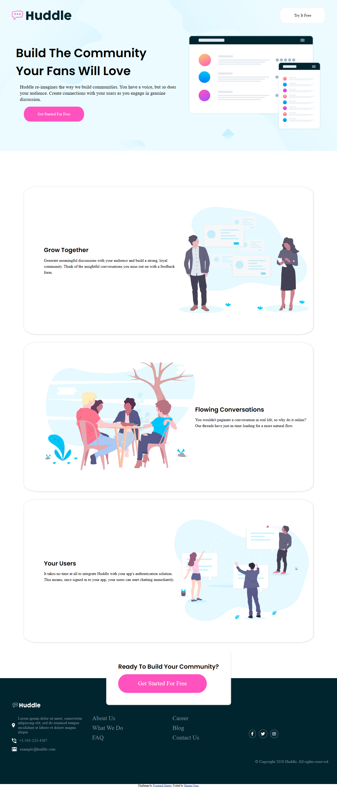
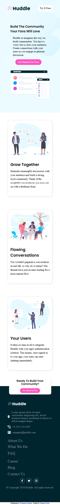

# Frontend Mentor - Huddle landing page with alternating feature blocks solution

## Welcome! 👋

This is a solution to the [Huddle landing page with alternating feature blocks challenge on Frontend Mentor](https://www.frontendmentor.io/challenges/huddle-landing-page-with-alternating-feature-blocks-5ca5f5981e82137ec91a5100). Frontend Mentor challenges help you improve your coding skills by building realistic projects.

## Table of contents

- [The challenge](#the-challenge)
- [Screenshot](#screenshot)
- [Links](#links)

- [Built with](#built-with)
- [What I learned](#what-i-learned)
- [Continued development](#continued-development)
- [Useful resources](#useful-resources)
- [Author](#author)
- [Acknowledgments](#acknowledgments)

### The challenge

Users should be able to:

- View the optimal layout for the site depending on their device's screen size
- See hover states for all interactive elements on the page

### Screenshot

the desktop result:



the mobile result:


### Links

-solution url[ https://github.com/hanemNaga/huddle-landing-page-with-alternating-feature-blocks-master]

## My process

### Built with

- Semantic HTML5 markup
- CSS custom properties
- Flexbox

- desktop-first workflow
- sass.
- font aweosome

### What I learned

Practice sass mexins and media query

```scss
@mixin media($b-points) {
  @if $b-points == mobile {
    @media (max-width: 991px) {
      @content;
    }
  } @else if $b-points == desktop {
    @media (min-width: 992px) {
      @content;
    }
  }
}
```


### Continued development

the web responsive using mobile first


## Author

- Website - [hanem Mohamed  naga]
- Frontend Mentor - [@yourusername](https://www.frontendmentor.io/profile/yourusername)
- linkedin - [hanem naga]([[https://www.linkedin.com/in/hanem-naga/]])

